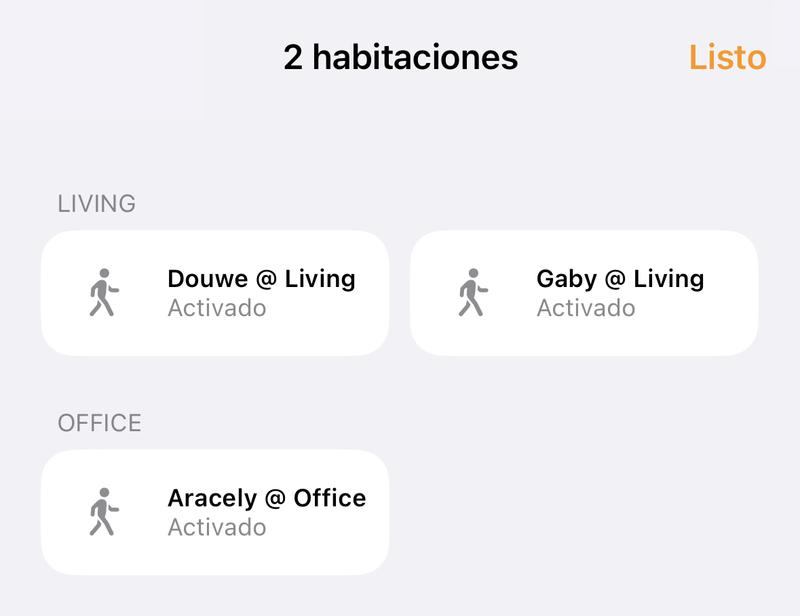

# Homebridge + UniFi = Occupancy

[Homebridge](https://homebridge.io) plugin that adds HomeKit occupancy sensors for all smartphones (and/or other portable devices) on a [UniFi](https://www.ui.com/wi-fi) network to your iOS Home app.

To enable tracking devices across rooms/areas/floors, every device gets a dedicated sensor per WiFi access point, named `<AP> <Name>` (so that the AP prefix is hidden by the Home app if it matches the room name).
<!-- TODO: Manually change room in Home -->

By default, only smartphones are included and are shown using the owner's name, which is derived from the device (host)name or alias (configured in the UniFi Network UI).
For example, `Douwe's iPhone` (English), `iPhone de Douwe` (Spanish), and `iPhone van Douwe` (Dutch) all become `Douwe`.
Both behaviors are configurable.

Access point aliases are configurable to map an AP name or MAC address to a room name, or to merge different APs into one sensor (per device).

PS. To see these smartphones in your macOS menu bar as well, check out [XBar + UniFi = Who's Home?](https://github.com/DouweM/xbar-whos-home-unifi).

## Screenshot



## Installation

The easiest way to install and configure this plugin is via [Homebridge Config UI X](https://github.com/oznu/homebridge-config-ui-x).

Alternatively, add `homebridge-unifi-occupancy` to your Homebridge `package.json` and add the following to `config.json`:

```json
{
  "platforms": [
    {
      "platform": "UnifiOccupancy",
      "unifi": {
          "controller": "https://192.168.1.1",
          "username": "<username>",
          "password": "<password>",
          "site": "default",
          "secure": false,
      },
      "interval": 180,
      "deviceType": {
        "smartphone": true,
        "laptop": false,
        "tablet": false,
        "smart_watch": false,
        "ereader": false,
        "game_console": false
      },
      "showAsOwner": "smartphone",
      "accessPointAliases": [
          {
              "accessPoint": "Dream Machine",
              "alias": "Living"
          },
          {
              "accessPoint": "Office nanoHD",
              "alias": "Office"
          },
          {
              "accessPoint": "Bedroom nanoHD",
              "alias": "Bedroom"
          },
          {
              "accessPoint": "Roof FlexHD",
              "alias": "Rooftop"
          }
      ]
    }
  ]
}
```
