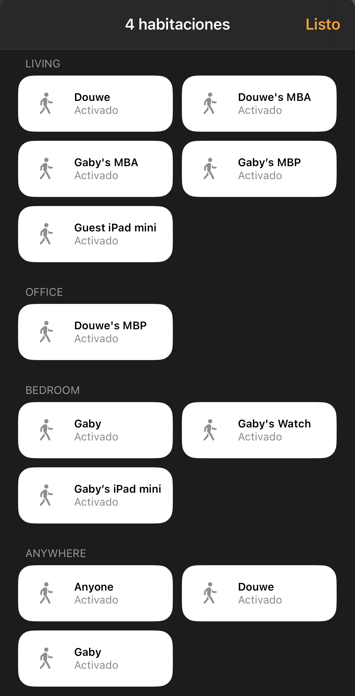

# Homebridge + UniFi = Occupancy

[Homebridge](https://homebridge.io) plugin that adds HomeKit occupancy sensors for selected (types of) devices on a [UniFi](https://www.ui.com/wi-fi) network to your iOS Home app.

By default, every smartphone gets an occupancy sensor for each access point (room/floor).

Access points can be mapped to rooms in Settings.
Note that the accessories still need to be manually assigned to the corresponding room in the Home app, which will then automatically hide the room name prefix in the sensor name.

By default, smartphones show up using their owner's name, which is derived from the device (host)name or the alias configured in the UniFi Network UI.
For example, `Douwe's iPhone` (English), `iPhone de Douwe` (Spanish), and `iPhone van Douwe` (Dutch) all show up as `Douwe`.

Other device types to create sensors for can be enabled in Settings.
Device types are determined using the device fingerprint in the UniFi Network UI, either detected automatically or assigned manually.

In addition to sensors for whether a specific device is in a specific room, sensors can be created for whether a specific device is in any room (with the special name `Anywhere`), whether any device of a specific type is in a specific room, or whether any device of a specific type is in any room.

PS. To see the smartphones on your network in your macOS menu bar as well, check out [XBar + UniFi = Who's Home?](https://github.com/DouweM/xbar-whos-home-unifi).

## Screenshot

<table>
  <thead>
    <tr>
      <td>Default</td>
      <td>Customized</td>
    </tr>
  </thead>
  <tbody>
    <tr>
      <td>Smartphones show as their owner</td>
      <td>Include smart watches, laptops, tablets, and "Anywhere" sensors</td>
    </tr>
    <tr>
      <td valign="top">
        
      </td>
      <td>
        
      </td>
    </tr>
  </tbody>
</table>

## Installation

The easiest way to install and configure this plugin is via [Homebridge Config UI X](https://github.com/oznu/homebridge-config-ui-x).

Alternatively, add `homebridge-unifi-occupancy` to your Homebridge `package.json` and add the following to `config.json`:

```json
{
  "platforms": [
    {
      "platform": "UnifiOccupancy",
      "unifi": {
          "controller": "https://192.168.1.1",
          "username": "<username>",
          "password": "<password>",
          "site": "default",
          "secure": false,
      },
      "interval": 180,
      "accessPointAliases": [
          {
              "accessPoint": "Dream Machine",
              "alias": "Living"
          },
          {
              "accessPoint": "Office nanoHD",
              "alias": "Office"
          },
          {
              "accessPoint": "Bedroom nanoHD",
              "alias": "Bedroom"
          },
          {
              "accessPoint": "Roof FlexHD",
              "alias": "Rooftop"
          }
      ],
      "showAsOwner": "smartphone",
      "deviceType": {
        "smartphone": {
          "roomAccessory": true,
          "homeAccessory": false,
          "roomCatchallAccessory": false,
          "homeCatchallAccessory": false,
          "lazy": false
        },
        "smart_watch": {
          "roomAccessory": false,
          "homeAccessory": false,
          "roomCatchallAccessory": false,
          "homeCatchallAccessory": false,
          "lazy": false
        },
        "laptop": {
          "roomAccessory": false,
          "homeAccessory": false,
          "roomCatchallAccessory": false,
          "homeCatchallAccessory": false,
          "lazy": false
        },
        "tablet": {
          "roomAccessory": false,
          "homeAccessory": false,
          "roomCatchallAccessory": false,
          "homeCatchallAccessory": false,
          "lazy": false
        },
        "ereader": {
          "roomAccessory": false,
          "homeAccessory": false,
          "roomCatchallAccessory": false,
          "homeCatchallAccessory": false,
          "lazy": false
        },
        "game_console": {
          "roomAccessory": false,
          "homeAccessory": false,
          "roomCatchallAccessory": false,
          "homeCatchallAccessory": false,
          "lazy": false
        },
        "handheld": {
          "roomAccessory": false,
          "homeAccessory": false,
          "roomCatchallAccessory": false,
          "homeCatchallAccessory": false,
          "lazy": true
        },
        "other": {
          "roomAccessory": false,
          "homeAccessory": false,
          "lazy": true
        },
        "wired": {
          "roomAccessory": false
        },
      },
      "clientRules": [
        {
          "label": "Douwe's devices",
          "namePatterns": [
            "/^Douwe/",
            "Nintendo Switch"
          ],
          "roomAccessory": true,
          "homeAccessory": false,
          "roomCatchallAccessory": false,
          "homeCatchallAccessory": false,
          "lazy": true
        }
      ]
    }
  ]
}
```
